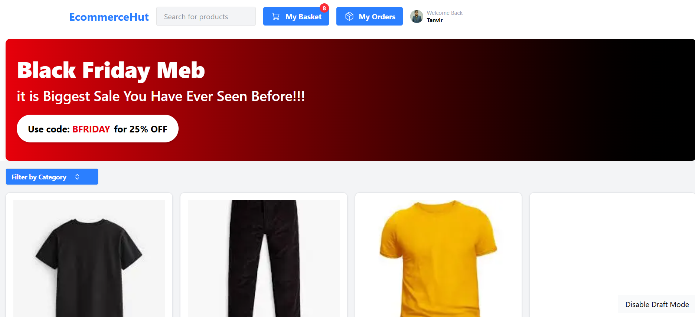
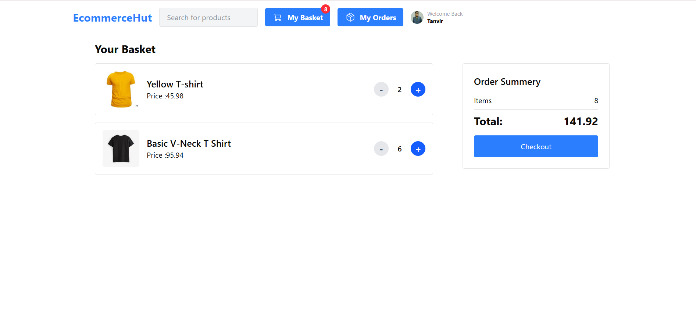
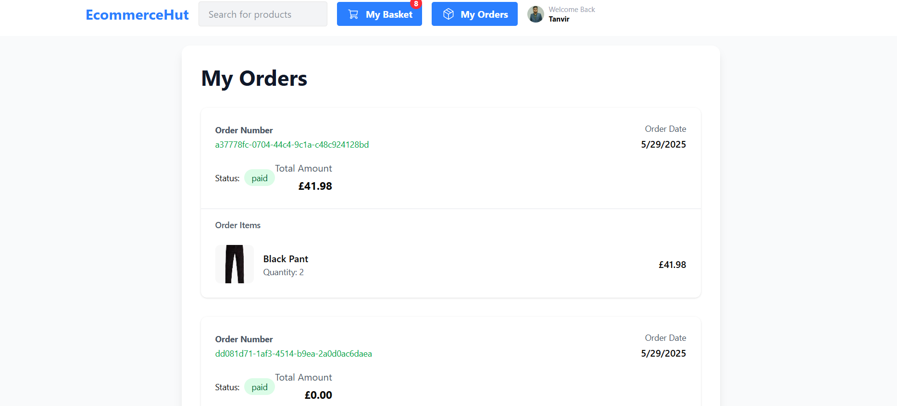
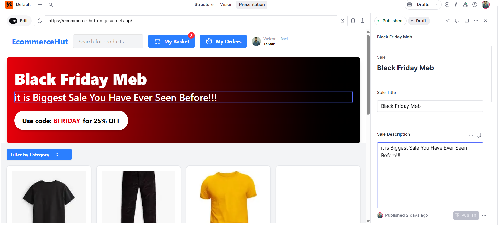

# EcommerceHut

A modern, full-featured e-commerce web application built with Next.js, TypeScript, Sanity CMS, Atom (state management), and Stripe for payments. The project supports live content editing via Sanity Studio and is production-ready for deployment.

## 🚀 Features

- **Next.js 13 App Router**: Fast, scalable, and SEO-friendly React framework.
- **TypeScript**: Type-safe codebase for reliability and maintainability.
- **Sanity CMS**: Real-time, headless CMS for product, category, and sale management with live editing.
- **Atom State Management**: Lightweight and efficient state management for basket and orders.
- **Stripe Integration**: Secure checkout and payment processing.
- **Responsive UI**: Clean, modern design with reusable components.
- **Category Filtering & Search**: Easily browse and search products.
- **Basket & Orders**: Add to basket, view order summary, and track orders.
- **Live Sale Banners**: Dynamic sales and coupon codes managed via Sanity Studio.
- **Draft Mode**: Instantly preview unpublished content changes.

## 🛠️ Tech Stack

- **Frontend**: Next.js, React, TypeScript
- **State Management**: Atom
- **CMS**: Sanity.io
- **Payments**: Stripe
- **Styling**: CSS Modules / Tailwind (if used)
- **Deployment**: Vercel

## 📦 Project Structure

```
ecomerce-website/
  ├── actions/                # Server actions (e.g., Stripe checkout)
  ├── public/                 # Static assets
  ├── src/
  │   ├── app/                # Next.js app directory (routes, layouts)
  │   ├── components/         # UI components
  │   ├── lib/                # Utility libraries (Stripe, formatting, etc.)
  │   └── sanity/             # Sanity CMS config, queries, and schemas
  ├── sanity.config.ts        # Sanity Studio configuration
  ├── package.json
  └── README.md
```

## 🖥️ Screenshots

-## 🖼️ Screenshots

### 🏠 Home Page



### 🛒 Basket



### Order Summary



### 🛠️ Sanity Studio



_(See `/public` or deployment for visuals)_

## 📝 Live Editing with Sanity Studio

- Access Sanity Studio at `/studio`
- Edit products, categories, and sales in real time
- Changes appear instantly on the site (draft mode supported)

## 💳 Stripe Payments

- Secure checkout flow
- Test mode enabled for development

## 🏁 Getting Started

1. **Clone the repository:**

   ```bash
   git clone https://github.com/tanvirTheDev/EcommerceHut.git
   cd ecomerce-website
   ```

2. **Install dependencies:**

   ```bash
   npm install
   # or
   yarn install
   ```

3. **Set up environment variables:**

   - Copy `.env.local.example` to `.env.local` and fill in your Sanity and Stripe keys.

4. **Run the development server:**

   ```bash
   npm run dev
   ```

5. **Open the app:**
   - Main site: [http://localhost:3000](http://localhost:3000)
   - Sanity Studio: [http://localhost:3000/studio](http://localhost:3000/studio)

## 🛠️ Customization

- Update product, category, and sale schemas in `src/sanity/schemaTypes/`
- Edit UI components in `src/components/`

## 🌐 Deployment

- Easily deploy to [Vercel](https://vercel.com/) or your preferred platform.

## 🙋‍♂️ Author

- **Tanvir Ahamed** — Linkedin [https://www.linkedin.com/in/tanvirthedev/]

---
